# Create projects and assign grant access to admins and developers

CP4BA ver. 21.0.2

## Add roles to users

Login using admin credentials to your environment, for example

https://cpd-dtecp4ba.itzroks-XXXXX-YYYYY-ZZZZZ.eu-gb.containers.appdomain.cloud/zen/#/homepage

### Granting access

Administrators can manage user and group permissions to access the repository you use for business applications and workflow business automations.

https://www.ibm.com/docs/en/cloud-paks/cp-biz-automation/21.0.x?topic=projects-granting-access

### Managing access to the repository for business applications

Access Administration menu and select Repository and registry access

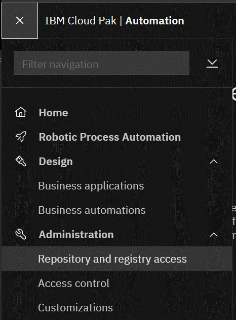

optional: use the Process Admin Console to add users/groups to tw_admins and tw_authors groups
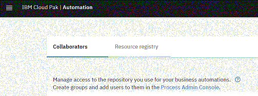

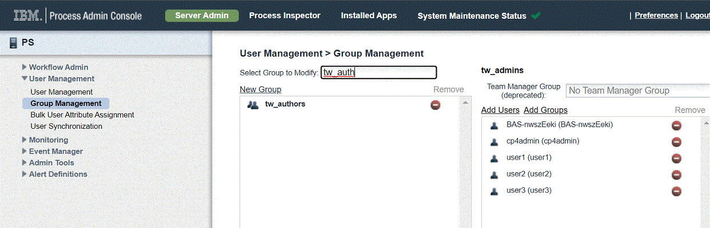

then back to Collaborators tab add users/groups using Add button

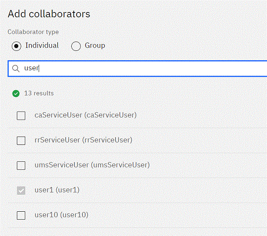

then select the role (Admin/Edit/Read)

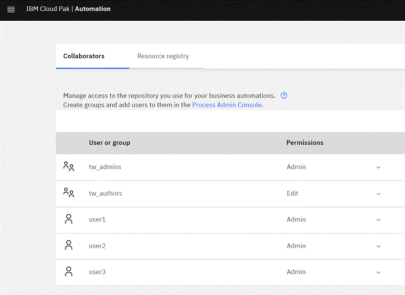

https://www.ibm.com/docs/en/cloud-paks/cp-biz-automation/21.0.x?topic=access-managing-repository-business-applications

### Managing access to the repository for workflow business automations

Access Administration menu, select Business automations 

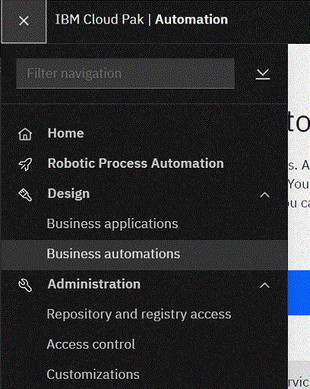

select Workflow then Administration

add users/groups using Add button

then select the role (Admin/Edit/Read)

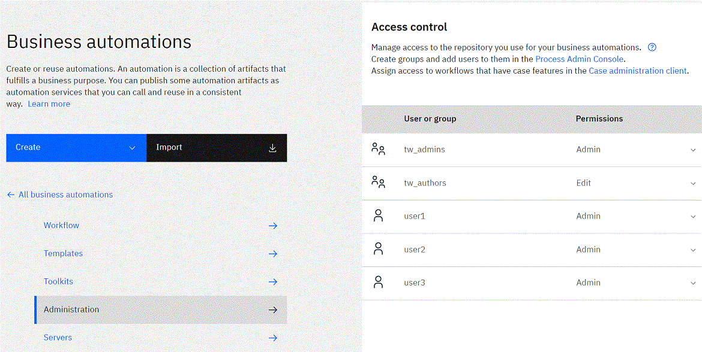

https://www.ibm.com/docs/en/cloud-paks/cp-biz-automation/21.0.x?topic=access-managing-repository-workflow-business-automations

Assign access to workflows that have case features in the Case administration client

Select dev_env_connection_definition then View and Edit, select Security tab then search for user/group name the add it to project area

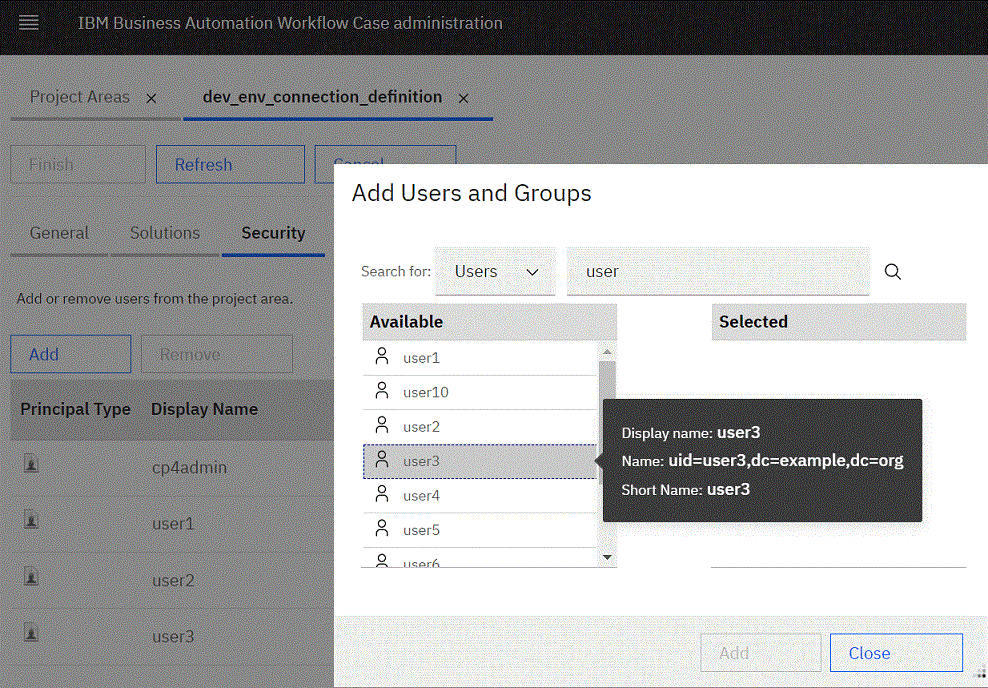

Now you are ready to create new projects.

## Create an Application project

Access Administration menu, select Business Applications 

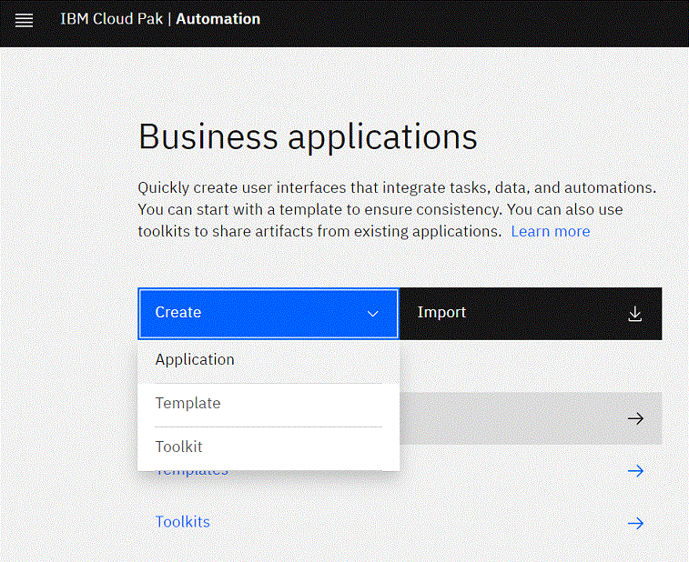

select Create then Application

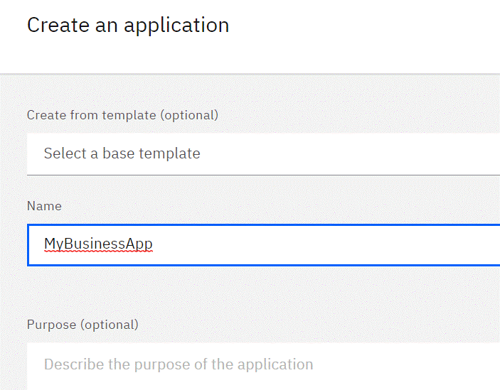

name it then press Create button, the application editor is now open

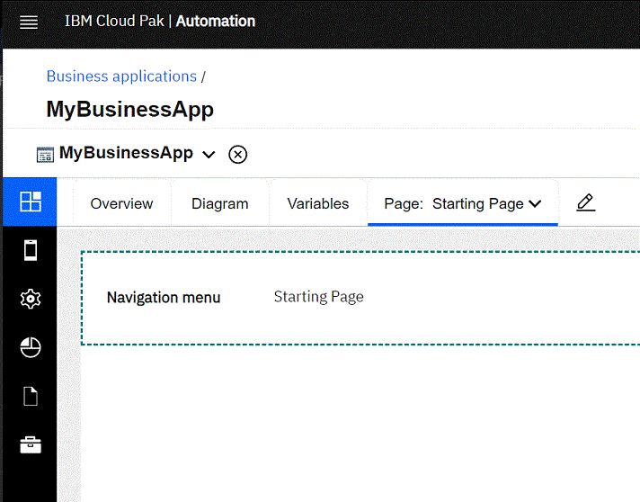

go back to Business Applications and Open the new app

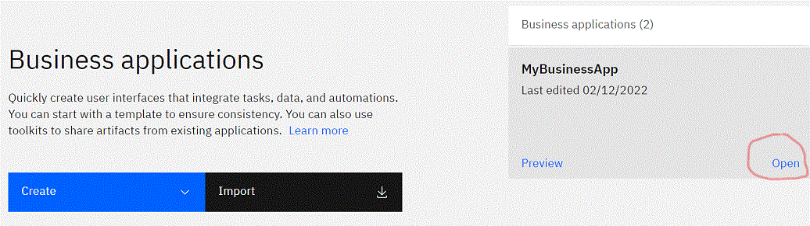

selct Collaborators tab then Add users/group

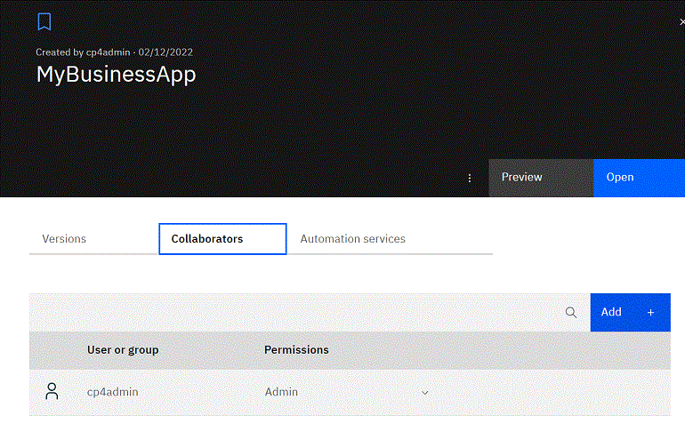
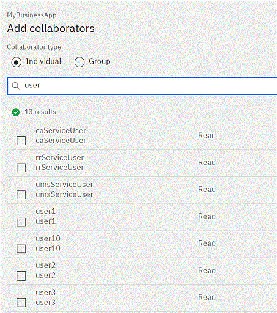

and select the role

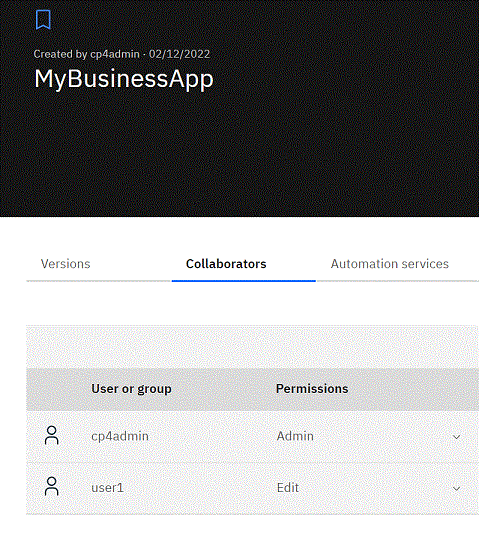

## Create an Automation project

Access Administration menu, select Business Automations
then selcect Create, Workflow and Workflow automation 

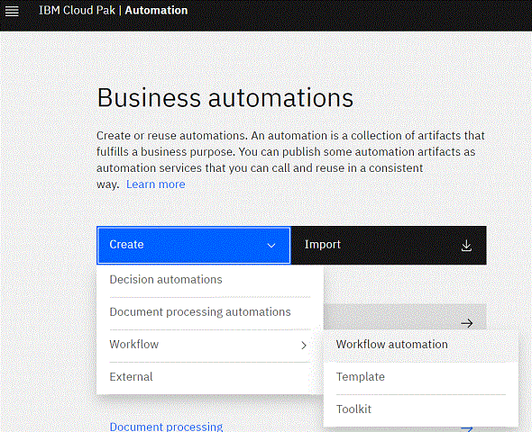

name it then press Create button, the process app editor is now open

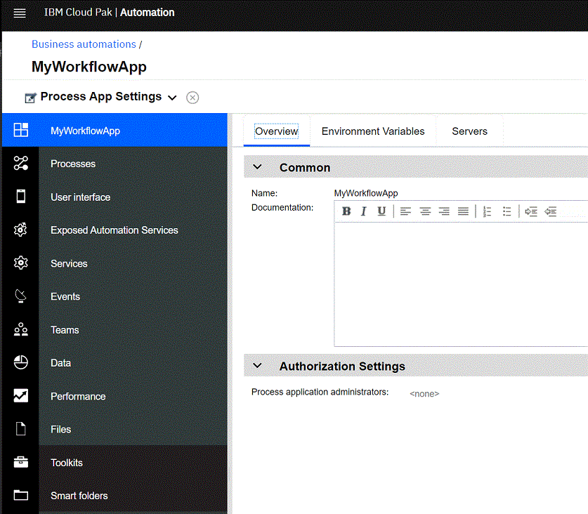

go back to Business automation and select Workflow then click on the newly created process app

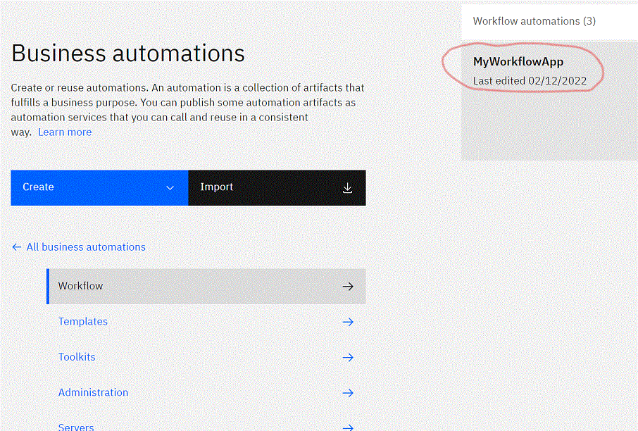

in workflow app info panel 

selct Collaborators tab then Add users/group as done before for the business app.

That's all folks !

Enjoy your IBM Cloud Pak for Business Automation.

https://www.ibm.com/docs/en/cloud-paks/cp-biz-automation
